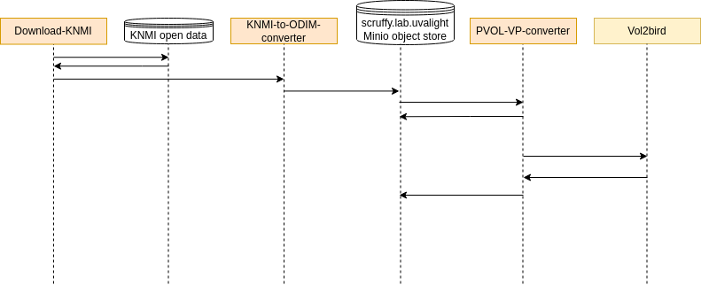

This page provides detailed documentation for RAVRE. A higher level overview of the RAVRE virtual lab is available on [the lab overview page](..).

### Viewpoints
#### Mathematical description
*ToDo: A mathematical description of the workflow.*

#### Computational description
*ToDo: How is the algorithm converted into computational methods?*

#### Engineering implementation / Architecture
The following processes take place in the RAVRE data processing pipeline:
1) Notebook cell *Download-KNMI* requests data from the KNMI open data platform.
2) KNNI data is returned to NaaVRE and locally stored.
3) Notebook cell *KNMI-to-odim-converter* retrieves the local data, pre-processes it, and stores it in a Minio object store.
4) Notebook cell *PVOL-VP-converter* retrieves the pre-processed data and sends it to the vol2bird using the command-line interface.
5) The vol2bird algorithm returns vertical profiles of biological scatters to *PVOL-VP-converter*.
6) Notebook cell *PVOL-VP-converter* stores the vertical profiles in Minio object store.

