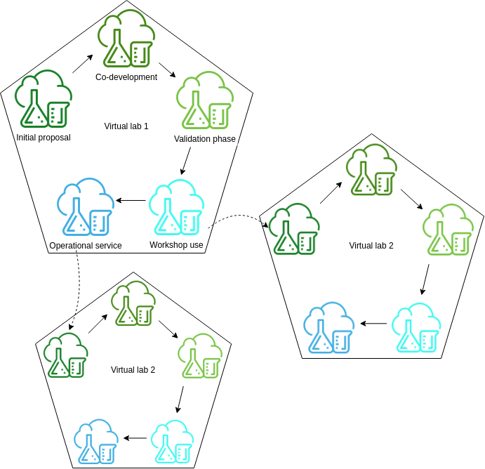

# Readiness level framework for virtual labs on the NaaVRE platform

import Downward_arrow from './images/Downward_arrow.drawio.svg';

Version 0.0.2

The NaaVRE platform facilitates data- and computing-centric research activities by enabling scientists to create customizable virtual labs for specific scientific purposes.
This is achieved through a collaborative co-development approach, bringing together domain specialists, computational scientists, data scientists, and development and operations engineers.

This readiness level framework assists researchers in building virtual labs by:
* Providing guidelines for the development of virtual labs.
* Identifying stakeholders.
* Describing the progression of a virtual lab through readiness levels,
highlighting requirements, milestones and responsibilities.

## Content of a virtual lab
A virtual lab provides a collection of research tools and assets customized for a specific research need:

* Assets created in the virtual lab.
* Documents that support the usability of the virtual lab.

### Assets
Three types of assets can be created in a virtual lab:

* The codebase: Any code written for the virtual lab. The codebase interacts with external resources such as software libraries and external data.
* Internal data: Produced in the virtual lab by data processing, data analysis, and simulations.
* Containerized cells and workflows.

### Documents
Besides assets, we encourage the developers of a virtual lab to create documents that aid the FAIRness and maintenance of the virtual lab:
* Metadata.
* Documentation, including a tutorial.

## Virtual lab roles /  Stakeholders
NaaVRE aims to be a virtual research environment (VRE) that enables experts in computational ecology and ecological data analysis
to create virtual labs.
Our platform needs contributions from the multiple roles to enable innovative research methods. Some people will only have
one role for the virtual lab, while others might have multiple of the following roles:

* **Virtual lab usage roles:** Roles of people who use an existing virtual lab for their own research.
  * **Golden user:** Provides a scientific scenario that can best be investigated in NaaVRE. Is involved in developing a
  new virtual lab and conducts research in that virtual lab.
  * **Silver user:** Starts using a virtual lab developed by others for their own scientific scenarios at an early stage.
  Learns how to use the virtual lab through a workshop, training or hackathon.
  * ***Ivory user:** Other users that visit or use the virtual lab in a later stage.
* **Virtual lab development roles:** Roles involved in the creation of a new virtual lab.
  * **Virtual lab principal investigator:** Coordinates the development of the virtual lab with a scientific vision.
  This will often be the golden user, i.e. the person that provides the initial publishable use case of the virtual lab.
  * **Virtual lab core developers:** Develop a new virtual lab in NaaVRE. Often the virtual lab owner will be one of the core developers.
  * **Virtual lab code reviewers:** Provide feedback during co-development on the user-friendliness, maintainability, and robustness of the
  source code and other assets.
* **Virtual lab support roles:** Roles to support development and use of virtual labs.
  * **Virtual lab trainer:** Knows the lab from a user viewpoint and provides trainings to new users. This role will often be assigned to a person who is also the virtual lab owner, a core developer, or service operator.
  * **Virtual lab coordinator:** Knows the lab from a technical perspective and pushes the lab to the next readiness level. Often, this will be an employee at LifeWatch ERIC VLIC
  * **Community supporter:** Forms connections between users and the virtual lab.
  * **Virtual research environment development and operations (VRE DevOps) engineer:** Maintains NaaVRE. Often, this will be an employee at LifeWatch ERIC VLIC.
  * **VRE researcher:** Contribute state-of-the-art components to the NaaVRE and can publish technical papers
  that demonstrate the relevance of NaaVRE in the field of networked systems.
  * **User supporter:** Can support users. Knows the potential and limitations of the lab and can help out when problems arise.
  * **Infrastructure supporter:** Ensures there is infrastructure that allows the virtual lab to be used by multiple users.
  * **Infrastructure provider:** Provides infrastructure for the virtual lab.

## Readiness levels
We discern five readiness levels in the development of a virtual lab.
For each higher readiness level improvements are be made to the assets and documents in order to make the lab usable by others
with an increasing amount of independence from the virtual lab core developers and VRE DevOps team.

<ul style={{ listStyleType: 'none' }}>
    <li> 
<Downward_arrow/>
 [L0 - Initial proposal](readiness_levels/L0_initial_proposal): The initial proposal of a virtual lab, with conceptual definition but no technical setup. </li>
    <li> <Downward_arrow/> [L1 - Co-development](readiness_levels/L1_co-development): A provisioned virtual lab is ready for the development team to implement the virtual lab functionality, e.g. new components, workflows, or experiments. </li>
    <li> <Downward_arrow/> [L2 - Validation phase](readiness_levels/L2_validation_phase): A provisioned virtual lab with developed components. It is ready to run scientific experiments to validate the virtual lab and write scientific publications. </li>
    <li> <Downward_arrow/> [L3 - Workshop use](readiness_levels/L3_workshop_use): A provisioned virtual lab with validated components and scientific stories. It is ready to engage more users through training and hackathons under controlled conditions. </li>
    <li> <Downward_arrow/> [L4 - Operational service](readiness_levels/L4_operational_service): A provisioned virtual lab on operational infrastructure. It is ready to be operational for serving users from the general public. </li>
</ul>

| Level | Name                | Duration    | Developers                  | Users | Context dissemination            | Entering condition                                                     | Exit condition                                                                     |
|-------|---------------------|-------------|-----------------------------|-------|----------------------------------|------------------------------------------------------------------------|------------------------------------------------------------------------------------|
| L0    | initial proposal    | 1-12 months | 0                           | 0     |                                  | A good idea & Available resources.                                     | Set up a concrete lab on the platform.                                             |
| L1    | Co-development      | 3-6 months  | A team of core developers   | 0     | Metadata publication             | A lab & a core development team.                                       | A lab ready for scientific experiments.                                            |
| L2    | Validation phase    | 3 months    | A team of core developers   | 1     | Paper publication                | A lab ready for writing a scientific paper.                            | One or two papers submitted to publication.                                        |
| L3    | Workshop use        | 3 months    | 10-25 workshop participants | 10-25 | Workshops, trainings, hackathons | A working lab with documentation and training material.                | The lab has been tested in workshops / hackathons, and has an emerging  community. |
| L4    | Operational service |             | 10 ≤ asset developers       | 10+   |                                  | The lab is operational, and can be managed on research infrastructure. |                                                                                    |

Table 1: Summary of readiness levels, with duration, number of developers and users,
how the context of the lab is communicated with the outside world, and what conditions per transition should be met.

Figure1: The virtual lab moves through the readiness levels, from initial proposal to operational service.
Users coming up with ideas for new experiments that can not be done in the existing virtual labs,
can, in collaboration with LifeWatch, create a new virtual lab that fits their needs.

## Sources
* These recommendations are partially based on ideas presented in the paper [Introducing the FAIR Principles for research software](https://www.nature.com/articles/s41597-022-01710-x), the [Fair software checklist](https://fairsoftwarechecklist.net/v0.2/), and [fair-software.eu](https://fair-software.eu/recommendations/license).

## Potential ToDos for LifeWatch VLIC
To be able to cycle through the entire readiness cycle described here, LifeWatch VLIC needs to provide the following:

* Make NaaVRE generate a persistent identifier and version number for containerized cells and executed workflows. https://github.com/QCDIS/projects_overview/issues/280
* Choose a metadata standard for Virtual labs.  https://github.com/QCDIS/projects_overview/issues/275
* Create recommendations on community standards for reading, writing and exchanging data in virtual labs. See github issue [#281](https://github.com/QCDIS/projects_overview/issues/281)
* Create recommendations for testing: https://github.com/QCDIS/projects_overview/issues/274
* Guideline for secret management https://github.com/QCDIS/projects_overview/issues/276
* Determine a way of structuring files in a virtual lab git repository that allows publication of the user manual and documentation on NaaVRE.net.  https://github.com/QCDIS/projects_overview/issues/279

## Feedback
Any feedback on this document is appreciated. Please contact the LifeWatch VLIC team if you have any questions or comments on the document.