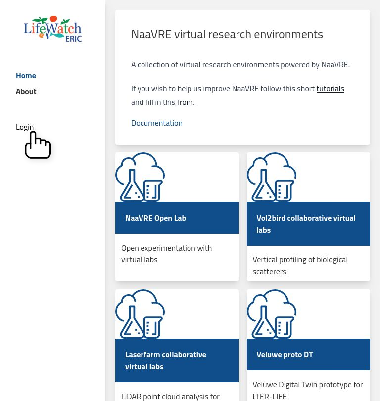
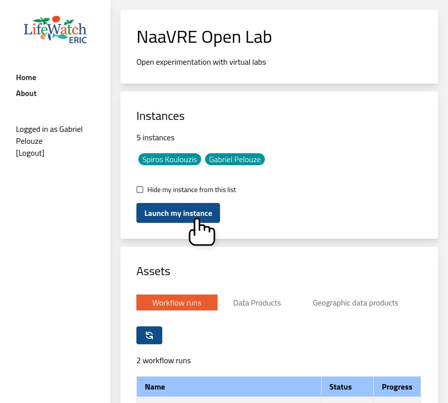
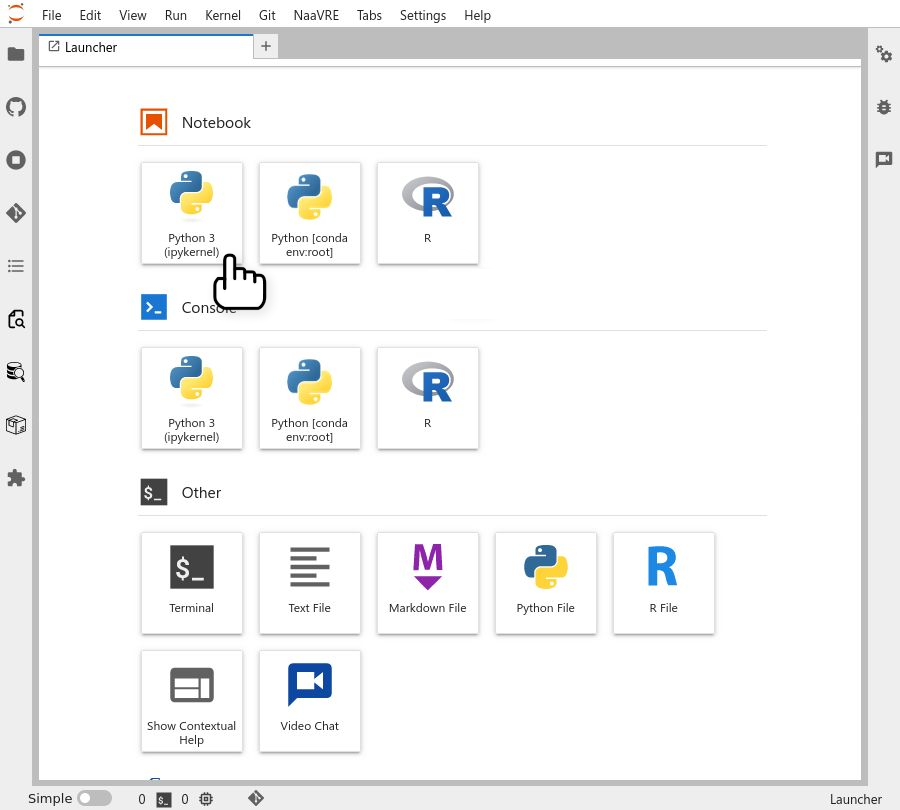
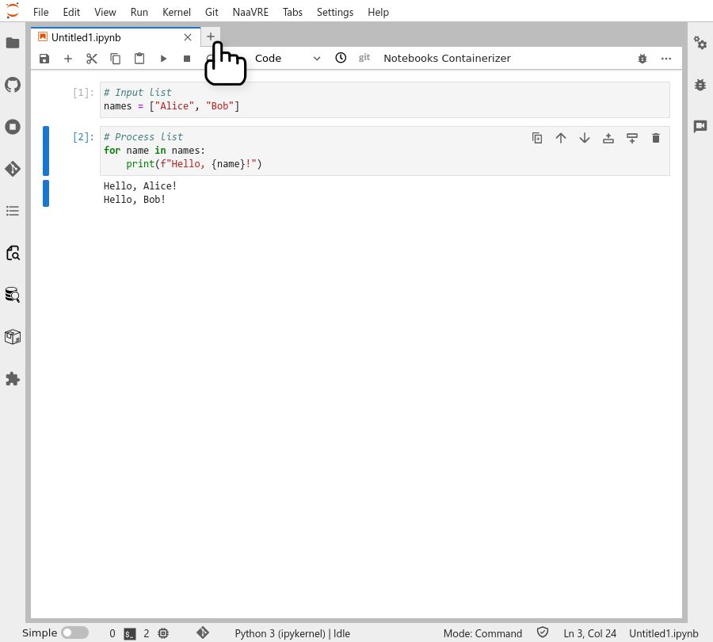
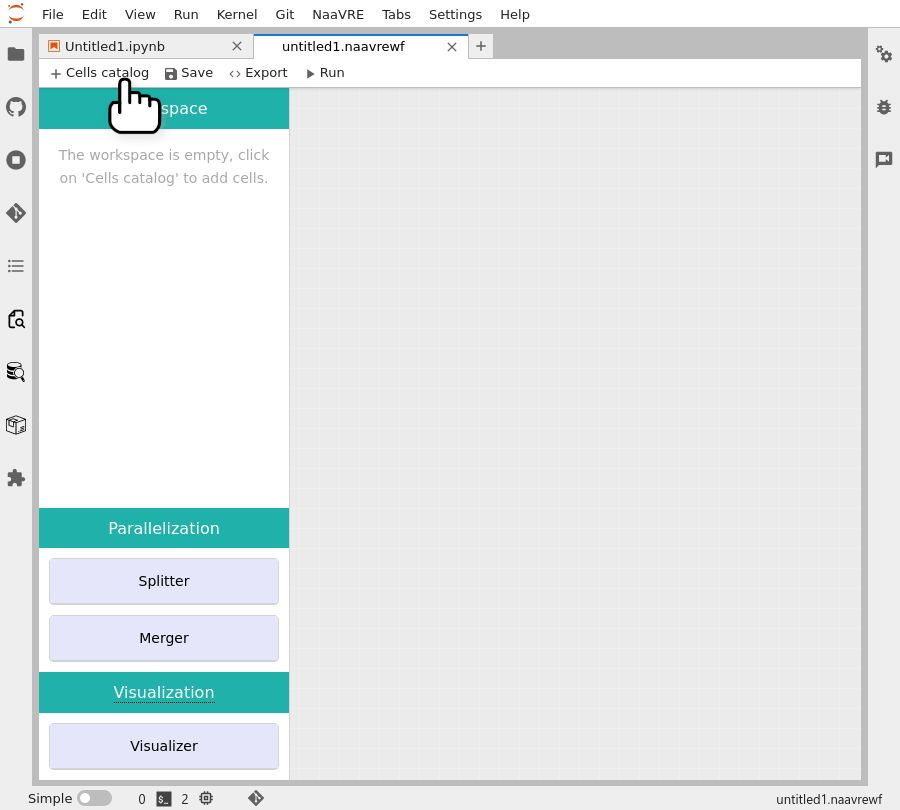
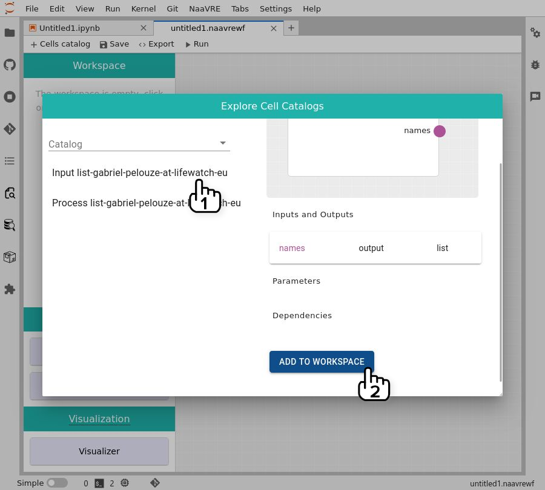
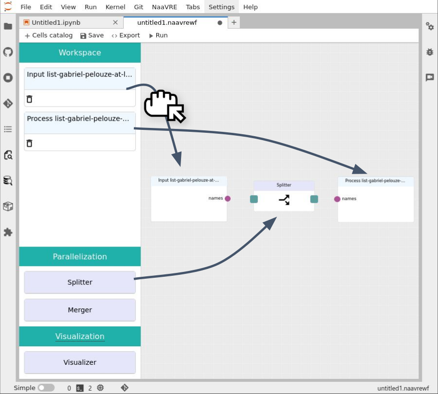
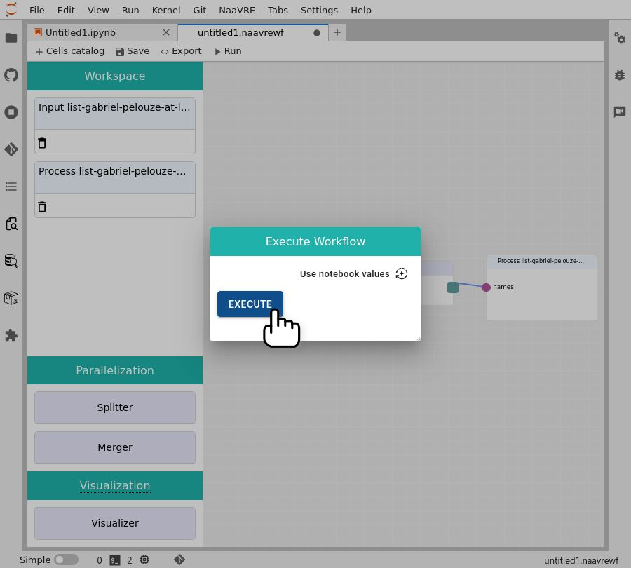
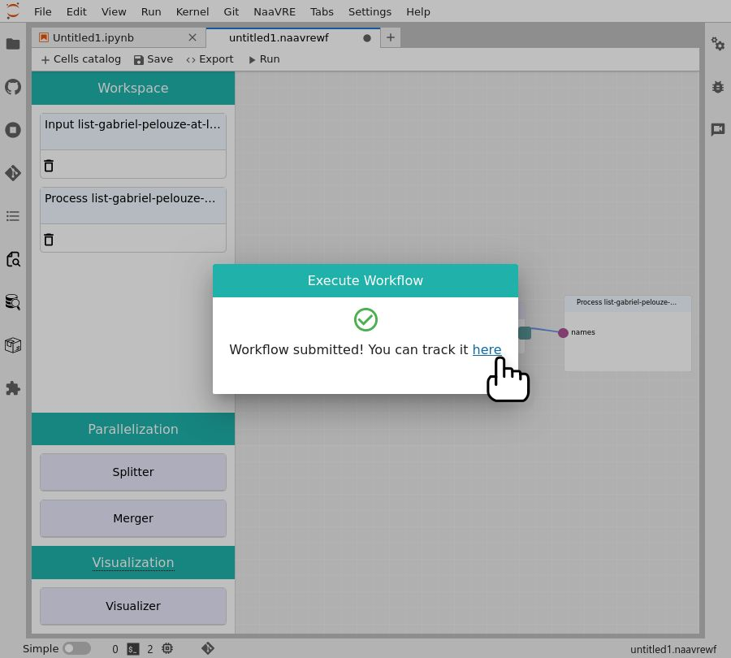

import TOCInline from '@theme/TOCInline';
import ReactPlayer from 'react-player'
import tutorialVideoURL from './videos/GettingStartedVRE.mp4';


# Getting Started with NaaVRE tutorial

The aim of this tutorial is to discover the basic functionalities of NaaVRE: logging in, starting your virtual lab, and creating a workflow from a notebook:

<TOCInline toc={toc} />

This is a screencast of the tutorial:

<ReactPlayer controls width='100%' height='auto' url={tutorialVideoURL} />

## Starting NaaVRE

Open the NaaVRE demo: https://naavre.lifewatch.dev.


### Signing in

Click on the 'Login' button.



Chose your preferred login method:

- option 1 (recommended): Google
- option 2: Federation with EOSC (provides several options such as GitHub or ORCID)


Log in with the chosen method (Google shown here)


### Pick your collaborative virtual lab

On the main panel, you will see several Virtual Labs (VLs).
For this tutorial, select the 'NaaVRE Open Lab'.


When in the VL you can see:

* A description of the VL
* The instances started by other users
* A button to start your own instance of the VL
* Assets from the Virtual lab:
  * Workflow runs 
  * Data products
  * Geographical data products



### Starting your virtual lab

Click on the 'Launch my instance' button.

This opens a new tab where your virtual lab will be started. Click on the 'Sign in' button.

On the new page click on the 'Sign in' button.


Your virtual lab instance starts up.


### The NaaVRE interface in Jupyter Lab

You now see the NaaVRE interface in Jupyter lab.
(You can read more details [here](../NaaVRE_Interface)).


## From notebook to workflow

### Create a notebook

Create a new Python or a R notebook by clicking on the 'Python 3' or the 'R' icon under 'Notebook' on the launcher tab.

:::note If the Launcher page is not open, click on the new tab button or 'File->New->New Launcher'.
:::




Add some code to the notebook. For this tutorial, we will use a simple 'hello, world' example over two cells. The first one sets the data (in a real world application, this cell could download data from a repository), the second one prints the data (this could correspond to processing the data and generating some figures).

If you chose Python:

```python
# Input list
names = ["Alice", "Bob"]
```

```python
# Process list
for name in names:
  print(f"Hello, {name}!")
```

If you chose R:

```R
# Input list
names = list("Alice", "Bob")
```

```R
# Process list
for (name in names) {
  print(sprintf("Hello, %s!", name))
}
```


### Containerize the cells

Open the component containerizer panel by clicking on the icon in the left-hand bar.


Select the first cell to containerize it.

On the left panel, you will see a preview of the containerized cell with the detected inputs, outputs, parameters and dependencies (if any).


Set the variable types to 'List'. For Python notebooks, type is inferred automatically.


Select the base image for the containerized cell ('r' or 'python' depending on your notebook).


Click on the 'Create' button.

:::warning
This publishes the contents of the cell to a public repository on GitHub. Do not containerize cells containing passwords, API keys, or any code you wish to keep private.
:::


Congratulations, you containerized your first cell!


Repeat the containerization cells for the second cell in the notebook.

### Compose a workflow

To compose a workflow open a new tab and click on the 'Experimenter Manager' icon.




Click on the 'Cells catalogue' button.



For each of the cells you created:
- select the cell,
- click on Add to workspace.



Drag and drop the two cells onto the canvas, as well as a 'splitter' cell.



Connect the cells nodes.

:::note
It is important to note that the direction of the connections between the cells is important as it indicates the flow of ]
data dependencies between the cells. Therefore, the flow should be: 'Input list' -> 'Splitter' -> 'Process list'.
:::


Click on the 'Run' button.


Click on 'Execute'

:::note
If your workflow uses [parameters](../NaaVRE_Interface/#special-variables), you can set their values here. To use values from the notebook, click on 'Use notebook values'.
:::



### Monitor the workflow

To check the progress of the workflow click on the link on the pop-up message.



This will take you to the workflow engine page where you can see the progress of the workflow. Click on a node to see its status and logs.


:::note
The first time you open the workflow engine, select the 'single sign-on' login, and close the welcome message.
:::
